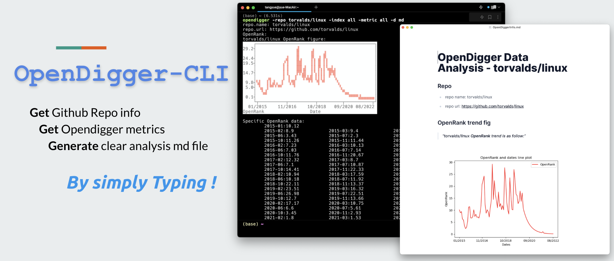
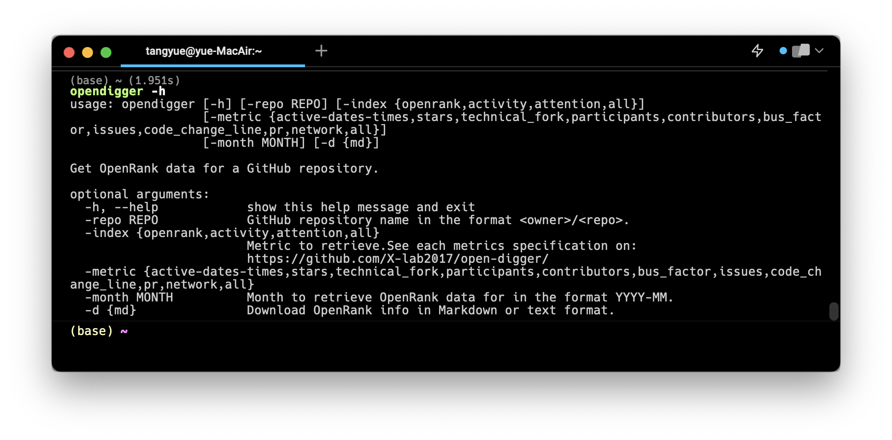

# OpenDigger CLI

[](https://badge.fury.io/py/opendigger)

Opendigger command line is designed for CLI enthusiasts who wish to gather diverse information and metrics that evaluate the quality of open-source projects related to a GitHub repository. For detailed information about the metrics, please refer to this [link](https://github.com/X-lab2017/open-digger).


###  [Download and install](https://pypi.org/project/opendigger/)

Prerequisites: `python3` environment

`pip install opendigger`


### Usage

#### Help

`opendigger -h`

#### Query openrank

`opendigger -repo <owner>/<repo-name> -index openrank `, 

e.g.`opendigger -repo torvalds/linux -index openrank`

### Query activity

`opendigger -repo <owner>/<repo-name> -index activity`

### Query attention

`opendigger -repo <owner>/<repo-name> -index activity`

### Query all index info

`opendigger -repo <owner>/<repo-name> -index all`

### Query metrics

Metrics option as follows:

```bash
[-metric {active-dates-times,stars,technical_fork,participants,contributors,bus_factor,issues,code_change_line,pr,network,all}]
```

if you want to show all the metrics, just choose `all`, then opendigger will retrieve you all the metrics about that repo


## ⚠️Warning

If you incur error like this or error imply you that program run wrong:

```bash
HTTPError: 404 - Not Found
HTTPError: 404 - Not Found
```

please check your network connection and try again. If still failed, you should consider to check the metrics on opendigger GitHub repo by yourself. Sorry for the inconveniences. 

## examples

You can see the example of the generated report in the examples directory in the Github Repo. [link](https://github.com/TOMYUE/opendigger-cli/tree/main/examples)
