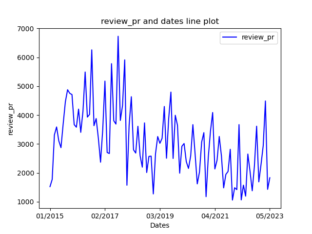

# OpenDigger Data Analysis - kubernetes/kubernetes

### Repo
- repo name: kubernetes/kubernetes
- repo url: https://github.com/kubernetes/kubernetes
#### OpenRank trend fig
> kubernetes/kubernetes **OpenRank** trend is as follow:

###  OpenRank data table
|Dates and OpenRank||||
| --- | --- | --- | --- |
| 2015-01: 66.69 | 2015-02: 106.74 | 2015-03: 169.92 | 2015-04: 238.09 |
| 2015-05: 288.59 | 2015-06: 329.49 | 2015-07: 410.36 | 2015-08: 501.91 |
| 2015-09: 549.99 | 2015-10: 573.22 | 2015-11: 637.32 | 2015-12: 672.1 |
| 2016-01: 690.59 | 2016-02: 730.28 | 2016-03: 740.62 | 2016-04: 796.59 |
| 2016-05: 847.44 | 2016-06: 861.8 | 2016-07: 929.47 | 2016-08: 1028.96 |
| 2016-09: 1062.68 | 2016-10: 1139.33 | 2016-11: 1152.21 | 2016-12: 1134.14 |
| 2017-01: 1156.65 | 2017-02: 1250.92 | 2017-03: 1197.94 | 2017-04: 1201.07 |
| 2017-05: 1312.43 | 2017-06: 1335.87 | 2017-07: 1338.85 | 2017-08: 1386.55 |
| 2017-09: 1346.42 | 2017-10: 1392.04 | 2017-11: 1532.73 | 2017-12: 1355.63 |
| 2018-01: 1416.27 | 2018-02: 1528.09 | 2018-03: 1436.3 | 2018-04: 1460.25 |
| 2018-05: 1563.06 | 2018-06: 1433.49 | 2018-07: 1372.05 | 2018-08: 1482.15 |
| 2018-09: 1434.7 | 2018-10: 1366.21 | 2018-11: 1361.96 | 2018-12: 1258.44 |
| 2019-01: 1271.15 | 2019-02: 1302.9 | 2019-03: 1283.29 | 2019-04: 1329.45 |
| 2019-05: 1506.63 | 2019-06: 1318.23 | 2019-07: 1372.72 | 2019-08: 1533.93 |
| 2019-09: 1391.78 | 2019-10: 1415.19 | 2019-11: 1538.01 | 2019-12: 1410.79 |
| 2020-01: 1396.91 | 2020-02: 1403.59 | 2020-03: 1278.04 | 2020-04: 1201.83 |
| 2020-05: 1247.83 | 2020-06: 1425.44 | 2020-07: 1381.36 | 2020-08: 1174.46 |
| 2020-09: 1106.56 | 2020-10: 1149.09 | 2020-11: 1315.74 | 2020-12: 1080.02 |
| 2021-01: 1132.62 | 2021-02: 1208.09 | 2021-03: 1317.87 | 2021-04: 1199.6 |
| 2021-05: 1159.11 | 2021-06: 1272.32 | 2021-07: 1195.1 | 2021-08: 1013.02 |
| 2021-09: 989.62 | 2021-10: 1007 | 2021-11: 1068.5 | 2021-12: 900.05 |
| 2022-01: 856.1 | 2022-02: 774.12 | 2022-03: 975.85 | 2022-04: 763.69 |
| 2022-05: 768 | 2022-06: 695.82 | 2022-07: 877.53 | 2022-08: 802.68 |
| 2022-09: 738.42 | 2022-10: 841.53 | 2022-11: 928.7 | 2022-12: 889.01 |
| 2023-01: 874.8 | 2023-02: 865.25 | 2023-03: 1016.81 | 2023-04: 871.97 |
| 2023-05: 810.85 || |  | 
#### Activity trend fig
> kubernetes/kubernetes **Activity** trend is as follow:

###  Activity data table
|Dates and Activities||||
| --- | --- | --- | --- |
| 2015-01: 945.22 | 2015-02: 1168.46 | 2015-03: 1566.37 | 2015-04: 1790.16 |
| 2015-05: 1797.29 | 2015-06: 1965.78 | 2015-07: 2114.92 | 2015-08: 3057.6 |
| 2015-09: 2465.43 | 2015-10: 2396.29 | 2015-11: 2447.18 | 2015-12: 2284.79 |
| 2016-01: 2260.42 | 2016-02: 2571.28 | 2016-03: 2597.81 | 2016-04: 2573.82 |
| 2016-05: 2998.25 | 2016-06: 2901.76 | 2016-07: 2910.37 | 2016-08: 3535.27 |
| 2016-09: 3203.27 | 2016-10: 3494.65 | 2016-11: 3206.16 | 2016-12: 2908.3 |
| 2017-01: 3157.34 | 2017-02: 3513.33 | 2017-03: 3403.57 | 2017-04: 3243.41 |
| 2017-05: 3982.62 | 2017-06: 3826.51 | 2017-07: 3661.01 | 2017-08: 4448.19 |
| 2017-09: 3810.89 | 2017-10: 3986.57 | 2017-11: 4285.31 | 2017-12: 2966.7 |
| 2018-01: 3861.19 | 2018-02: 3941.22 | 2018-03: 3662.43 | 2018-04: 3301.02 |
| 2018-05: 3454.61 | 2018-06: 3199.08 | 2018-07: 3152.99 | 2018-08: 3641.63 |
| 2018-09: 3117.74 | 2018-10: 3402.47 | 2018-11: 3129.47 | 2018-12: 2617.83 |
| 2019-01: 3397.26 | 2019-02: 3568.62 | 2019-03: 3635.07 | 2019-04: 3611.62 |
| 2019-05: 3882.78 | 2019-06: 3192.43 | 2019-07: 3752.55 | 2019-08: 3920.72 |
| 2019-09: 3252.85 | 2019-10: 3786.13 | 2019-11: 3516.13 | 2019-12: 2951.71 |
| 2020-01: 3313.19 | 2020-02: 3288.17 | 2020-03: 3247.72 | 2020-04: 3087.4 |
| 2020-05: 3251.2 | 2020-06: 3780.88 | 2020-07: 3490.76 | 2020-08: 2754.63 |
| 2020-09: 2934.27 | 2020-10: 3147.44 | 2020-11: 3305.44 | 2020-12: 2424.85 |
| 2021-01: 2969.4 | 2021-02: 3156.05 | 2021-03: 3607.46 | 2021-04: 3010.82 |
| 2021-05: 2810.27 | 2021-06: 3088.02 | 2021-07: 2668.13 | 2021-08: 2181.24 |
| 2021-09: 2436.75 | 2021-10: 2393 | 2021-11: 2658.65 | 2021-12: 1883.47 |
| 2022-01: 2457.48 | 2022-02: 2003.82 | 2022-03: 2787.65 | 2022-04: 1796.23 |
| 2022-05: 1945.57 | 2022-06: 1975.32 | 2022-07: 2384.7 | 2022-08: 2277.86 |
| 2022-09: 2016.91 | 2022-10: 2216.24 | 2022-11: 2511.3 | 2022-12: 2023.15 |
| 2023-01: 2257.88 | 2023-02: 2424.08 | 2023-03: 2700.28 | 2023-04: 1897.96 |
| 2023-05: 2135.96 || |  | 
#### Attention trend fig
> kubernetes/kubernetes **Attention** trend is as follow:

###  Attention data table
|Dates and Attention||||
| --- | --- | --- | --- |
| 2015-01: 738 | 2015-02: 734 | 2015-03: 942 | 2015-04: 1080 |
| 2015-05: 1084 | 2015-06: 1244 | 2015-07: 1516 | 2015-08: 1138 |
| 2015-09: 1058 | 2015-10: 1027 | 2015-11: 1249 | 2015-12: 977 |
| 2016-01: 1109 | 2016-02: 1035 | 2016-03: 1394 | 2016-04: 1205 |
| 2016-05: 1243 | 2016-06: 1179 | 2016-07: 1455 | 2016-08: 1338 |
| 2016-09: 1593 | 2016-10: 1614 | 2016-11: 1654 | 2016-12: 1713 |
| 2017-01: 1470 | 2017-02: 1581 | 2017-03: 2079 | 2017-04: 1796 |
| 2017-05: 1830 | 2017-06: 1808 | 2017-07: 1903 | 2017-08: 2066 |
| 2017-09: 1731 | 2017-10: 2090 | 2017-11: 2197 | 2017-12: 2066 |
| 2018-01: 2403 | 2018-02: 2035 | 2018-03: 2849 | 2018-04: 2063 |
| 2018-05: 2152 | 2018-06: 2031 | 2018-07: 2169 | 2018-08: 2426 |
| 2018-09: 2114 | 2018-10: 2196 | 2018-11: 2236 | 2018-12: 2805 |
| 2019-01: 2516 | 2019-02: 2276 | 2019-03: 3021 | 2019-04: 3115 |
| 2019-05: 3067 | 2019-06: 2517 | 2019-07: 2969 | 2019-08: 2650 |
| 2019-09: 2338 | 2019-10: 2355 | 2019-11: 2567 | 2019-12: 2510 |
| 2020-01: 2217 | 2020-02: 1905 | 2020-03: 2154 | 2020-04: 2317 |
| 2020-05: 2380 | 2020-06: 2283 | 2020-07: 2337 | 2020-08: 2003 |
| 2020-09: 1969 | 2020-10: 1916 | 2020-11: 1929 | 2020-12: 2267 |
| 2021-01: 1939 | 2021-02: 1794 | 2021-03: 2140 | 2021-04: 2108 |
| 2021-05: 1867 | 2021-06: 2216 | 2021-07: 1904 | 2021-08: 1849 |
| 2021-09: 2009 | 2021-10: 1964 | 2021-11: 1946 | 2021-12: 2017 |
| 2022-01: 2154 | 2022-02: 1787 | 2022-03: 2244 | 2022-04: 1877 |
| 2022-05: 1823 | 2022-06: 1618 | 2022-07: 1812 | 2022-08: 2036 |
| 2022-09: 1801 | 2022-10: 1700 | 2022-11: 1719 | 2022-12: 1305 |
| 2023-01: 1526 | 2023-02: 1616 | 2023-03: 1694 | 2023-04: 1810 |
| 2023-05: 1588 || |  | 
### Repo Metrics
#### Stars⭐️per month for kubernetes/kubernetes:
{'2015-01': 434, '2015-02': 418, '2015-03': 498, '2015-04': 638, '2015-05': 622, '2015-06': 714, '2015-07': 852, '2015-08': 558, '2015-09': 578, '2015-10': 527, '2015-11': 605, '2015-12': 439, '2016-01': 575, '2016-02': 563, '2016-03': 736, '2016-04': 567, '2016-05': 591, '2016-06': 559, '2016-07': 753, '2016-08': 648, '2016-09': 859, '2016-10': 874, '2016-11': 838, '2016-12': 907, '2017-01': 670, '2017-02': 875, '2017-03': 1075, '2017-04': 906, '2017-05': 912, '2017-06': 958, '2017-07': 1013, '2017-08': 1154, '2017-09': 913, '2017-10': 1156, '2017-11': 1245, '2017-12': 1242, '2018-01': 1431, '2018-02': 1151, '2018-03': 1565, '2018-04': 1195, '2018-05': 1340, '2018-06': 1189, '2018-07': 1289, '2018-08': 1372, '2018-09': 1246, '2018-10': 1170, '2018-11': 1306, '2018-12': 1533, '2019-01': 1426, '2019-02': 1338, '2019-03': 1771, '2019-04': 1711, '2019-05': 1665, '2019-06': 1339, '2019-07': 1557, '2019-08': 1416, '2019-09': 1230, '2019-10': 1213, '2019-11': 1265, '2019-12': 1384, '2020-01': 1169, '2020-02': 1001, '2020-03': 1138, '2020-04': 1211, '2020-05': 1172, '2020-06': 1161, '2020-07': 1249, '2020-08': 1015, '2020-09': 1029, '2020-10': 966, '2020-11': 915, '2020-12': 1291, '2021-01': 949, '2021-02': 906, '2021-03': 1148, '2021-04': 1174, '2021-05': 969, '2021-06': 1188, '2021-07': 1038, '2021-08': 1075, '2021-09': 1039, '2021-10': 1062, '2021-11': 1070, '2021-12': 1081, '2022-01': 1146, '2022-02': 977, '2022-03': 1170, '2022-04': 1083, '2022-05': 1029, '2022-06': 916, '2022-07': 1018, '2022-08': 1072, '2022-09': 953, '2022-10': 926, '2022-11': 899, '2022-12': 733, '2023-01': 802, '2023-02': 870, '2023-03': 878, '2023-04': 1014, '2023-05': 922, '2021-10-raw': 391} ⭐️
#### Stars trend fig
> kubernetes/kubernetes **Stars** trend is as follow:

- Issues for kubernetes/kubernetes:
  - issue new: {'2015-01': 340, '2015-02': 352, '2015-03': 494, '2015-04': 489, '2015-05': 579, '2015-06': 655, '2015-07': 566, '2015-08': 504, '2015-09': 581, '2015-10': 664, '2015-11': 565, '2015-12': 527, '2016-01': 483, '2016-02': 886, '2016-03': 767, '2016-04': 631, '2016-05': 768, '2016-06': 853, '2016-07': 718, '2016-08': 914, '2016-09': 949, '2016-10': 976, '2016-11': 804, '2016-12': 744, '2017-01': 579, '2017-02': 469, '2017-03': 794, '2017-04': 511, '2017-05': 511, '2017-06': 682, '2017-07': 620, '2017-08': 694, '2017-09': 594, '2017-10': 588, '2017-11': 668, '2017-12': 451, '2018-01': 538, '2018-02': 466, '2018-03': 600, '2018-04': 440, '2018-05': 379, '2018-06': 413, '2018-07': 434, '2018-08': 423, '2018-09': 433, '2018-10': 439, '2018-11': 371, '2018-12': 310, '2019-01': 367, '2019-02': 380, '2019-03': 469, '2019-04': 443, '2019-05': 434, '2019-06': 372, '2019-07': 498, '2019-08': 455, '2019-09': 435, '2019-10': 443, '2019-11': 417, '2019-12': 405, '2020-01': 380, '2020-02': 358, '2020-03': 417, '2020-04': 384, '2020-05': 370, '2020-06': 426, '2020-07': 404, '2020-08': 336, '2020-09': 386, '2020-10': 341, '2020-11': 343, '2020-12': 249, '2021-01': 312, '2021-02': 291, '2021-03': 338, '2021-04': 282, '2021-05': 259, '2021-06': 327, '2021-07': 230, '2021-08': 202, '2021-09': 234, '2021-10': 243, '2021-11': 285, '2021-12': 205, '2022-01': 227, '2022-02': 169, '2022-03': 252, '2022-04': 195, '2022-05': 178, '2022-06': 171, '2022-07': 190, '2022-08': 223, '2022-09': 193, '2022-10': 195, '2022-11': 235, '2022-12': 168, '2023-01': 196, '2023-02': 238, '2023-03': 266, '2023-04': 161, '2023-05': 183, '2021-10-raw': 87}
  - issue closed: {'2015-01': 203, '2015-02': 261, '2015-03': 432, '2015-04': 354, '2015-05': 338, '2015-06': 452, '2015-07': 428, '2015-08': 501, '2015-09': 354, '2015-10': 490, '2015-11': 321, '2015-12': 327, '2016-01': 387, '2016-02': 681, '2016-03': 501, '2016-04': 357, '2016-05': 633, '2016-06': 774, '2016-07': 390, '2016-08': 625, '2016-09': 635, '2016-10': 572, '2016-11': 749, '2016-12': 479, '2017-01': 412, '2017-02': 343, '2017-03': 950, '2017-04': 411, '2017-05': 741, '2017-06': 1270, '2017-07': 410, '2017-08': 517, '2017-09': 617, '2017-10': 581, '2017-11': 529, '2017-12': 545, '2018-01': 869, '2018-02': 1387, '2018-03': 800, '2018-04': 473, '2018-05': 428, '2018-06': 447, '2018-07': 377, '2018-08': 444, '2018-09': 380, '2018-10': 411, '2018-11': 367, '2018-12': 317, '2019-01': 371, '2019-02': 374, '2019-03': 444, '2019-04': 433, '2019-05': 474, '2019-06': 387, '2019-07': 414, '2019-08': 405, '2019-09': 348, '2019-10': 450, '2019-11': 446, '2019-12': 397, '2020-01': 434, '2020-02': 417, '2020-03': 453, '2020-04': 412, '2020-05': 369, '2020-06': 379, '2020-07': 399, '2020-08': 341, '2020-09': 332, '2020-10': 372, '2020-11': 343, '2020-12': 258, '2021-01': 355, '2021-02': 283, '2021-03': 374, '2021-04': 285, '2021-05': 243, '2021-06': 435, '2021-07': 271, '2021-08': 187, '2021-09': 246, '2021-10': 249, '2021-11': 305, '2021-12': 190, '2022-01': 247, '2022-02': 190, '2022-03': 241, '2022-04': 189, '2022-05': 161, '2022-06': 187, '2022-07': 181, '2022-08': 233, '2022-09': 221, '2022-10': 206, '2022-11': 200, '2022-12': 194, '2023-01': 179, '2023-02': 207, '2023-03': 223, '2023-04': 148, '2023-05': 176, '2021-10-raw': 96}
  - issue comments: {'2015-01': 4581, '2015-02': 5169, '2015-03': 8084, '2015-04': 8386, '2015-05': 9014, '2015-06': 11976, '2015-07': 13175, '2015-08': 12532, '2015-09': 16294, '2015-10': 18870, '2015-11': 14447, '2015-12': 15439, '2016-01': 15762, '2016-02': 21745, '2016-03': 16373, '2016-04': 15768, '2016-05': 21153, '2016-06': 22510, '2016-07': 19725, '2016-08': 29267, '2016-09': 26300, '2016-10': 32286, '2016-11': 29037, '2016-12': 31896, '2017-01': 31385, '2017-02': 32205, '2017-03': 28596, '2017-04': 22614, '2017-05': 28185, '2017-06': 29634, '2017-07': 27946, '2017-08': 35862, '2017-09': 32223, '2017-10': 28100, '2017-11': 32863, '2017-12': 18584, '2018-01': 26950, '2018-02': 26758, '2018-03': 24932, '2018-04': 20813, '2018-05': 24734, '2018-06': 19570, '2018-07': 16747, '2018-08': 22722, '2018-09': 17408, '2018-10': 17967, '2018-11': 17585, '2018-12': 12281, '2019-01': 18230, '2019-02': 16969, '2019-03': 18536, '2019-04': 22123, '2019-05': 24744, '2019-06': 15661, '2019-07': 20673, '2019-08': 23128, '2019-09': 16547, '2019-10': 22346, '2019-11': 19888, '2019-12': 15977, '2020-01': 21983, '2020-02': 22216, '2020-03': 17814, '2020-04': 17151, '2020-05': 21007, '2020-06': 26544, '2020-07': 25136, '2020-08': 13025, '2020-09': 14259, '2020-10': 17153, '2020-11': 22509, '2020-12': 10771, '2021-01': 16369, '2021-02': 19495, '2021-03': 23547, '2021-04': 16568, '2021-05': 14700, '2021-06': 17231, '2021-07': 13651, '2021-08': 9873, '2021-09': 11805, '2021-10': 11626, '2021-11': 13737, '2021-12': 8038, '2022-01': 12254, '2022-02': 8605, '2022-03': 16628, '2022-04': 7582, '2022-05': 8441, '2022-06': 7663, '2022-07': 11421, '2022-08': 9928, '2022-09': 9562, '2022-10': 10451, '2022-11': 12830, '2022-12': 10103, '2023-01': 13030, '2023-02': 11711, '2023-03': 15682, '2023-04': 8789, '2023-05': 10371, '2021-10-raw': 5064}
#### Code change line info for kubernetes/kubernetes:
#### code_chang_lines_add trend fig
> kubernetes/kubernetes **code_chang_lines_add** trend is as follow:

#### code_chang_lines_remove trend fig
> kubernetes/kubernetes **code_chang_lines_remove** trend is as follow:

#### code_chang_lines_sum trend fig
> kubernetes/kubernetes **code_chang_lines_sum** trend is as follow:

#### PR for kubernetes/kubernetes:
#### open_pr trend fig
> kubernetes/kubernetes **open_pr** trend is as follow:

#### accepted_pr trend fig
> kubernetes/kubernetes **accepted_pr** trend is as follow:

#### review_pr trend fig
> kubernetes/kubernetes **review_pr** trend is as follow:

