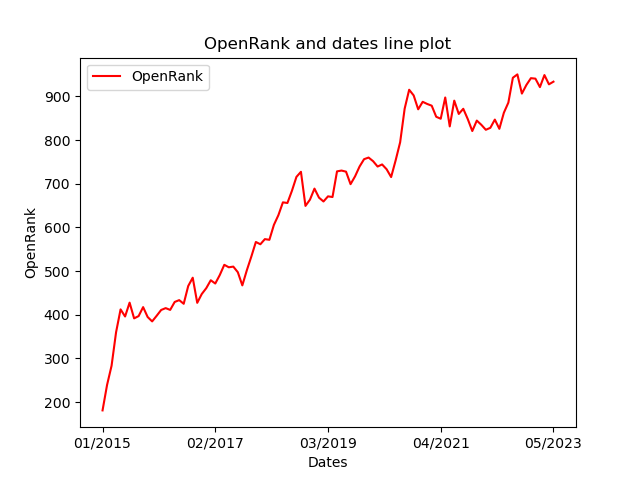
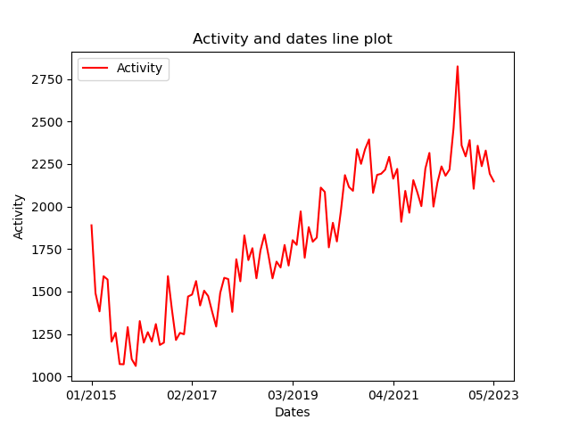
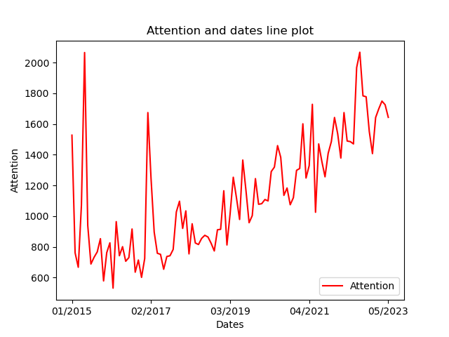

# OpenDigger Data Analysis - rust-lang/rust

### Repo
- repo name: rust-lang/rust
- repo url: https://github.com/rust-lang/rust
### OpenRank trend fig
> rust-lang/rust **OpenRank** trend is as follow:

###  OpenRank data table
|Dates and OpenRank||||
| --- | --- | --- | --- |
| 2015-01: 180.97 | 2015-02: 239.17 | 2015-03: 283.19 | 2015-04: 359.95 |
| 2015-05: 412.29 | 2015-06: 396.02 | 2015-07: 427.73 | 2015-08: 391.71 |
| 2015-09: 396.95 | 2015-10: 417.5 | 2015-11: 394.87 | 2015-12: 384.79 |
| 2016-01: 397.63 | 2016-02: 410.97 | 2016-03: 415.19 | 2016-04: 411.13 |
| 2016-05: 429.32 | 2016-06: 433.49 | 2016-07: 425.11 | 2016-08: 465.86 |
| 2016-09: 484.85 | 2016-10: 427.3 | 2016-11: 447.44 | 2016-12: 460.86 |
| 2017-01: 479.03 | 2017-02: 471.52 | 2017-03: 490.97 | 2017-04: 514.37 |
| 2017-05: 508.71 | 2017-06: 510.26 | 2017-07: 497.44 | 2017-08: 467.27 |
| 2017-09: 501.95 | 2017-10: 533.28 | 2017-11: 566.65 | 2017-12: 561.43 |
| 2018-01: 573.21 | 2018-02: 571.65 | 2018-03: 605.72 | 2018-04: 628.12 |
| 2018-05: 657.43 | 2018-06: 655.94 | 2018-07: 683.84 | 2018-08: 715.69 |
| 2018-09: 727.39 | 2018-10: 649.27 | 2018-11: 663.6 | 2018-12: 688.87 |
| 2019-01: 668.2 | 2019-02: 659.41 | 2019-03: 671.15 | 2019-04: 669.62 |
| 2019-05: 728.38 | 2019-06: 730.22 | 2019-07: 727.67 | 2019-08: 699.04 |
| 2019-09: 716.91 | 2019-10: 739.46 | 2019-11: 756.27 | 2019-12: 760 |
| 2020-01: 751.69 | 2020-02: 739.41 | 2020-03: 744.22 | 2020-04: 733.2 |
| 2020-05: 715.33 | 2020-06: 753.54 | 2020-07: 795.02 | 2020-08: 871.93 |
| 2020-09: 915.27 | 2020-10: 902.27 | 2020-11: 870.49 | 2020-12: 887.65 |
| 2021-01: 882.72 | 2021-02: 878.77 | 2021-03: 853.39 | 2021-04: 848.86 |
| 2021-05: 897.58 | 2021-06: 831.33 | 2021-07: 890.33 | 2021-08: 859.86 |
| 2021-09: 871.67 | 2021-10: 848 | 2021-11: 820.74 | 2021-12: 844.63 |
| 2022-01: 835.03 | 2022-02: 823.61 | 2022-03: 828.06 | 2022-04: 846.94 |
| 2022-05: 825.8 | 2022-06: 862.56 | 2022-07: 885.85 | 2022-08: 942.75 |
| 2022-09: 950.42 | 2022-10: 906.49 | 2022-11: 926.27 | 2022-12: 941.79 |
| 2023-01: 940.71 | 2023-02: 921.3 | 2023-03: 948.9 | 2023-04: 927.67 |
| 2023-05: 933.78 || |  | 
### Activity trend fig
> rust-lang/rust **Activity** trend is as follow:

###  Activity data table
|Dates and Activities||||
| --- | --- | --- | --- |
| 2015-01: 1889.62 | 2015-02: 1489.71 | 2015-03: 1383.13 | 2015-04: 1590 |
| 2015-05: 1570.5 | 2015-06: 1204.88 | 2015-07: 1257.51 | 2015-08: 1072.97 |
| 2015-09: 1071.71 | 2015-10: 1290.48 | 2015-11: 1102.04 | 2015-12: 1062.03 |
| 2016-01: 1325.92 | 2016-02: 1199.3 | 2016-03: 1260.8 | 2016-04: 1205.94 |
| 2016-05: 1308.46 | 2016-06: 1185.65 | 2016-07: 1199.22 | 2016-08: 1590.48 |
| 2016-09: 1392.39 | 2016-10: 1214.64 | 2016-11: 1256.61 | 2016-12: 1248.41 |
| 2017-01: 1470.37 | 2017-02: 1482.01 | 2017-03: 1561.45 | 2017-04: 1417.76 |
| 2017-05: 1504.75 | 2017-06: 1473.18 | 2017-07: 1380.27 | 2017-08: 1293.66 |
| 2017-09: 1492.06 | 2017-10: 1580.53 | 2017-11: 1572.95 | 2017-12: 1380.17 |
| 2018-01: 1689.83 | 2018-02: 1559.95 | 2018-03: 1830.12 | 2018-04: 1684.73 |
| 2018-05: 1754.94 | 2018-06: 1577.75 | 2018-07: 1741.46 | 2018-08: 1835.15 |
| 2018-09: 1711.47 | 2018-10: 1577.26 | 2018-11: 1675.89 | 2018-12: 1641.19 |
| 2019-01: 1773.85 | 2019-02: 1652.57 | 2019-03: 1801.89 | 2019-04: 1774.34 |
| 2019-05: 1971.26 | 2019-06: 1698.73 | 2019-07: 1878.89 | 2019-08: 1792.99 |
| 2019-09: 1817.39 | 2019-10: 2111.39 | 2019-11: 2085.6 | 2019-12: 1759.66 |
| 2020-01: 1904.32 | 2020-02: 1794.36 | 2020-03: 1975.09 | 2020-04: 2184.84 |
| 2020-05: 2114.9 | 2020-06: 2092.46 | 2020-07: 2337.59 | 2020-08: 2250.92 |
| 2020-09: 2337.23 | 2020-10: 2394.72 | 2020-11: 2080.34 | 2020-12: 2186.23 |
| 2021-01: 2192.72 | 2021-02: 2216.69 | 2021-03: 2292.35 | 2021-04: 2163.73 |
| 2021-05: 2221.36 | 2021-06: 1910.14 | 2021-07: 2091.97 | 2021-08: 1963.58 |
| 2021-09: 2155.31 | 2021-10: 2083 | 2021-11: 2002.19 | 2021-12: 2224.06 |
| 2022-01: 2315.1 | 2022-02: 1999.79 | 2022-03: 2141.41 | 2022-04: 2236.08 |
| 2022-05: 2180.93 | 2022-06: 2217.62 | 2022-07: 2461.57 | 2022-08: 2824.77 |
| 2022-09: 2359.71 | 2022-10: 2295.19 | 2022-11: 2390.57 | 2022-12: 2104.47 |
| 2023-01: 2357.55 | 2023-02: 2237.31 | 2023-03: 2329.43 | 2023-04: 2192.66 |
| 2023-05: 2147.91 || |  | 
### Attention trend fig
> rust-lang/rust **Attention** trend is as follow:

###  Attention data table
|Dates and Attention||||
| --- | --- | --- | --- |
| 2015-01: 1527 | 2015-02: 761 | 2015-03: 667 | 2015-04: 1072 |
| 2015-05: 2065 | 2015-06: 939 | 2015-07: 688 | 2015-08: 732 |
| 2015-09: 767 | 2015-10: 853 | 2015-11: 578 | 2015-12: 762 |
| 2016-01: 826 | 2016-02: 531 | 2016-03: 964 | 2016-04: 742 |
| 2016-05: 801 | 2016-06: 706 | 2016-07: 730 | 2016-08: 916 |
| 2016-09: 635 | 2016-10: 714 | 2016-11: 601 | 2016-12: 724 |
| 2017-01: 1674 | 2017-02: 1246 | 2017-03: 896 | 2017-04: 758 |
| 2017-05: 751 | 2017-06: 654 | 2017-07: 737 | 2017-08: 742 |
| 2017-09: 783 | 2017-10: 1027 | 2017-11: 1097 | 2017-12: 920 |
| 2018-01: 1034 | 2018-02: 754 | 2018-03: 950 | 2018-04: 825 |
| 2018-05: 815 | 2018-06: 855 | 2018-07: 875 | 2018-08: 864 |
| 2018-09: 823 | 2018-10: 773 | 2018-11: 911 | 2018-12: 914 |
| 2019-01: 1165 | 2019-02: 812 | 2019-03: 1016 | 2019-04: 1253 |
| 2019-05: 1120 | 2019-06: 978 | 2019-07: 1365 | 2019-08: 1169 |
| 2019-09: 957 | 2019-10: 1003 | 2019-11: 1244 | 2019-12: 1077 |
| 2020-01: 1081 | 2020-02: 1108 | 2020-03: 1099 | 2020-04: 1290 |
| 2020-05: 1319 | 2020-06: 1459 | 2020-07: 1383 | 2020-08: 1135 |
| 2020-09: 1183 | 2020-10: 1074 | 2020-11: 1120 | 2020-12: 1298 |
| 2021-01: 1310 | 2021-02: 1601 | 2021-03: 1248 | 2021-04: 1329 |
| 2021-05: 1728 | 2021-06: 1025 | 2021-07: 1470 | 2021-08: 1356 |
| 2021-09: 1256 | 2021-10: 1409 | 2021-11: 1485 | 2021-12: 1642 |
| 2022-01: 1537 | 2022-02: 1378 | 2022-03: 1674 | 2022-04: 1489 |
| 2022-05: 1485 | 2022-06: 1470 | 2022-07: 1967 | 2022-08: 2067 |
| 2022-09: 1783 | 2022-10: 1777 | 2022-11: 1550 | 2022-12: 1407 |
| 2023-01: 1642 | 2023-02: 1699 | 2023-03: 1749 | 2023-04: 1725 |
| 2023-05: 1643 || |  | 
