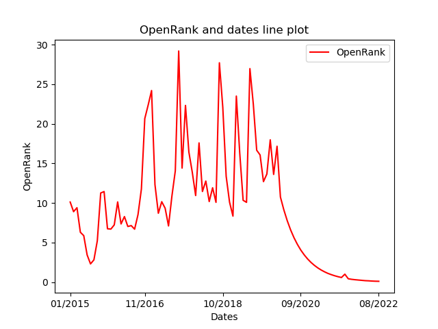
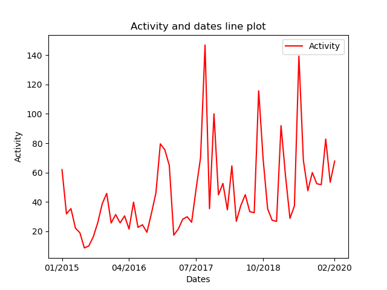
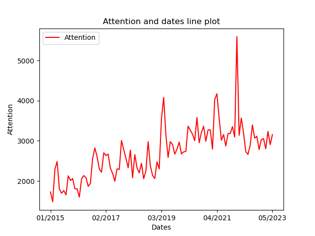

# OpenDigger Data Analysis - torvalds/linux

### Repo
- repo name: torvalds/linux
- repo url: https://github.com/torvalds/linux
### OpenRank trend fig
> torvalds/linux **OpenRank** trend is as follow:

###  OpenRank data table
|Dates and OpenRank||||
| --- | --- | --- | --- |
| 2015-01: 10.12 | 2015-02: 8.9 | 2015-03: 9.4 | 2015-04: 6.3 |
| 2015-05: 5.87 | 2015-06: 3.43 | 2015-07: 2.3 | 2015-08: 2.81 |
| 2015-09: 5.22 | 2015-10: 11.26 | 2015-11: 11.44 | 2015-12: 6.74 |
| 2016-01: 6.7 | 2016-02: 7.23 | 2016-03: 10.13 | 2016-04: 7.35 |
| 2016-05: 8.28 | 2016-06: 7.03 | 2016-07: 7.14 | 2016-08: 6.69 |
| 2016-09: 8.53 | 2016-10: 11.76 | 2016-11: 20.67 | 2016-12: 22.38 |
| 2017-01: 24.21 | 2017-02: 12.32 | 2017-03: 8.7 | 2017-04: 10.16 |
| 2017-05: 9.34 | 2017-06: 7.1 | 2017-07: 10.87 | 2017-08: 14.06 |
| 2017-09: 29.21 | 2017-10: 14.41 | 2017-11: 22.33 | 2017-12: 16.44 |
| 2018-01: 13.9 | 2018-02: 10.94 | 2018-03: 17.59 | 2018-04: 11.45 |
| 2018-05: 12.77 | 2018-06: 10.18 | 2018-07: 11.92 | 2018-08: 10.08 |
| 2018-09: 27.72 | 2018-10: 22.11 | 2018-11: 13.37 | 2018-12: 10.1 |
| 2019-01: 8.34 | 2019-02: 23.51 | 2019-03: 16.32 | 2019-04: 10.34 |
| 2019-05: 10.08 | 2019-06: 26.98 | 2019-07: 22.51 | 2019-08: 16.67 |
| 2019-09: 16.07 | 2019-10: 12.7 | 2019-11: 13.66 | 2019-12: 17.98 |
| 2020-01: 13.61 | 2020-02: 17.17 | 2020-03: 10.75 | 2020-04: 9.14 |
| 2020-05: 7.77 | 2020-06: 6.6 | 2020-07: 5.61 | 2020-08: 4.77 |
| 2020-09: 4.05 | 2020-10: 3.45 | 2020-11: 2.93 | 2020-12: 2.49 |
| 2021-01: 2.12 | 2021-02: 1.8 | 2021-03: 1.53 | 2021-04: 1.3 |
| 2021-05: 1.1 | 2021-06: 0.94 | 2021-07: 0.8 | 2021-08: 0.68 |
| 2021-09: 0.58 | 2021-10: 1 | 2021-11: 0.42 | 2021-12: 0.35 |
| 2022-01: 0.3 | 2022-02: 0.26 | 2022-03: 0.22 | 2022-04: 0.18 |
| 2022-05: 0.16 | 2022-06: 0.13 | 2022-07: 0.11 | 2022-08: 0.1 |
### Activity trend fig
> torvalds/linux **Activity** trend is as follow:

###  Activity data table
|Dates and Activities||||
| --- | --- | --- | --- |
| 2015-01: 62.03 | 2015-02: 31.9 | 2015-03: 35.5 | 2015-04: 22.21 |
| 2015-05: 19.08 | 2015-06: 8.73 | 2015-07: 10.1 | 2015-08: 16.34 |
| 2015-09: 25.94 | 2015-10: 38.78 | 2015-11: 45.84 | 2015-12: 25.72 |
| 2016-01: 31.44 | 2016-02: 25.81 | 2016-03: 30.56 | 2016-04: 21.58 |
| 2016-05: 39.88 | 2016-06: 22.76 | 2016-07: 24.49 | 2016-08: 19.39 |
| 2016-09: 32.2 | 2016-10: 45.94 | 2016-11: 79.57 | 2016-12: 75.55 |
| 2017-01: 64.89 | 2017-02: 17.46 | 2017-03: 21.52 | 2017-04: 28.24 |
| 2017-05: 29.96 | 2017-06: 26.21 | 2017-07: 48.91 | 2017-08: 70.24 |
| 2017-09: 146.84 | 2017-10: 35.45 | 2017-11: 99.98 | 2017-12: 44.88 |
| 2018-01: 52.66 | 2018-02: 34.67 | 2018-03: 64.59 | 2018-04: 26.87 |
| 2018-05: 37.54 | 2018-06: 44.98 | 2018-07: 33.45 | 2018-08: 32.7 |
| 2018-09: 115.66 | 2018-10: 69.02 | 2018-11: 35.46 | 2018-12: 27.63 |
| 2019-01: 26.82 | 2019-02: 91.96 | 2019-03: 57.8 | 2019-04: 28.85 |
| 2019-05: 37.44 | 2019-06: 139.31 | 2019-07: 68.38 | 2019-08: 47.66 |
| 2019-09: 60.05 | 2019-10: 52.39 | 2019-11: 51.81 | 2019-12: 82.82 |
| 2020-01: 53.42 | 2020-02: 67.84 || | 
### Attention trend fig
> torvalds/linux **Attention** trend is as follow:

###  Attention data table
|Dates and Attention||||
| --- | --- | --- | --- |
| 2015-01: 1725 | 2015-02: 1480 | 2015-03: 2294 | 2015-04: 2485 |
| 2015-05: 1804 | 2015-06: 1693 | 2015-07: 1760 | 2015-08: 1653 |
| 2015-09: 2128 | 2015-10: 2010 | 2015-11: 2060 | 2015-12: 1803 |
| 2016-01: 1802 | 2016-02: 1596 | 2016-03: 2050 | 2016-04: 2134 |
| 2016-05: 2082 | 2016-06: 1865 | 2016-07: 1943 | 2016-08: 2561 |
| 2016-09: 2823 | 2016-10: 2607 | 2016-11: 2297 | 2016-12: 2216 |
| 2017-01: 2703 | 2017-02: 2633 | 2017-03: 2668 | 2017-04: 2316 |
| 2017-05: 2188 | 2017-06: 1991 | 2017-07: 2304 | 2017-08: 2286 |
| 2017-09: 3010 | 2017-10: 2783 | 2017-11: 2570 | 2017-12: 2328 |
| 2018-01: 2769 | 2018-02: 2079 | 2018-03: 2658 | 2018-04: 2323 |
| 2018-05: 2200 | 2018-06: 2440 | 2018-07: 2055 | 2018-08: 2250 |
| 2018-09: 2979 | 2018-10: 2376 | 2018-11: 2137 | 2018-12: 2058 |
| 2019-01: 2476 | 2019-02: 2301 | 2019-03: 3542 | 2019-04: 4084 |
| 2019-05: 3154 | 2019-06: 2587 | 2019-07: 2979 | 2019-08: 2909 |
| 2019-09: 2669 | 2019-10: 2793 | 2019-11: 2970 | 2019-12: 2674 |
| 2020-01: 2725 | 2020-02: 2736 | 2020-03: 3366 | 2020-04: 3266 |
| 2020-05: 3165 | 2020-06: 3005 | 2020-07: 3582 | 2020-08: 2952 |
| 2020-09: 3204 | 2020-10: 3367 | 2020-11: 2990 | 2020-12: 3271 |
| 2021-01: 3275 | 2021-02: 2795 | 2021-03: 4030 | 2021-04: 4175 |
| 2021-05: 3565 | 2021-06: 3014 | 2021-07: 3159 | 2021-08: 2871 |
| 2021-09: 3181 | 2021-10: 3183 | 2021-11: 3357 | 2021-12: 3095 |
| 2022-01: 5601 | 2022-02: 3138 | 2022-03: 3567 | 2022-04: 3194 |
| 2022-05: 2731 | 2022-06: 2662 | 2022-07: 2891 | 2022-08: 3398 |
| 2022-09: 3068 | 2022-10: 3113 | 2022-11: 2784 | 2022-12: 3032 |
| 2023-01: 3056 | 2023-02: 2802 | 2023-03: 3235 | 2023-04: 2905 |
| 2023-05: 3156 || |  | 
